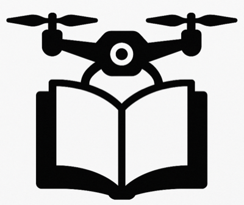

  

  
# FPV Drones Knowledge Base
  
A growing, work-in-progress knowledge base for FPV (First Person View) drone enthusiasts

## Contents

### HDZero

- **[HDZero RTSP Streaming Setup Guide](hdzero/streaming.md)** - Complete guide for streaming HDZero RTSP video to both local networks and the internet using dual WiFi adapters on Windows. Learn how to share live FPV footage with friends worldwide using VLC and Cloudflare tunnels.

### Tinywhoop Setup

- **[HappyModel Mobula6 HD Race (HDZero Edition) Setup Guide](happymodel-tinywhoop-setup/setup.md)** - Step-by-step Betaflight configuration guide for the Mobula6 HD Race (HDZero edition) BNF tinywhoop. Covers initial setup with critical cooling requirements, receiver configuration, flight modes, OSD customization, and pre-flight checks for getting your drone ready to fly.

### RadioMaster Transmitters

- **[RadioMaster Transmitters](radiomaster-transmitters/README.md)** - Notes, Setup, FAQ and troubleshooting for popular RadioMaster transmitter models including the Boxer, TX16S, and Pocket.

## Contributing

Feel free to contribute additional guides, tutorials, or improvements to existing documentation. 
