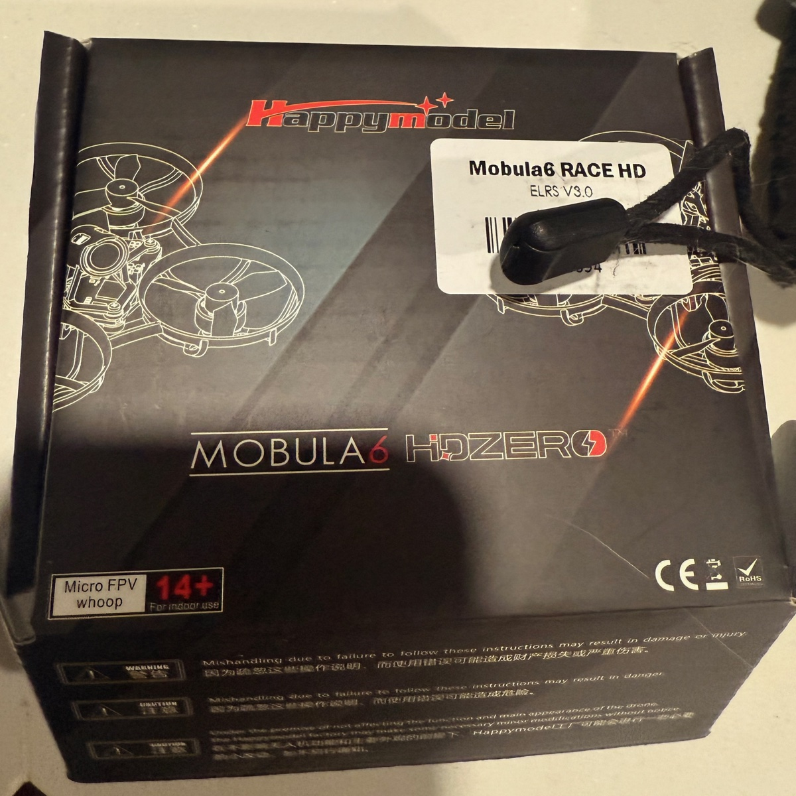
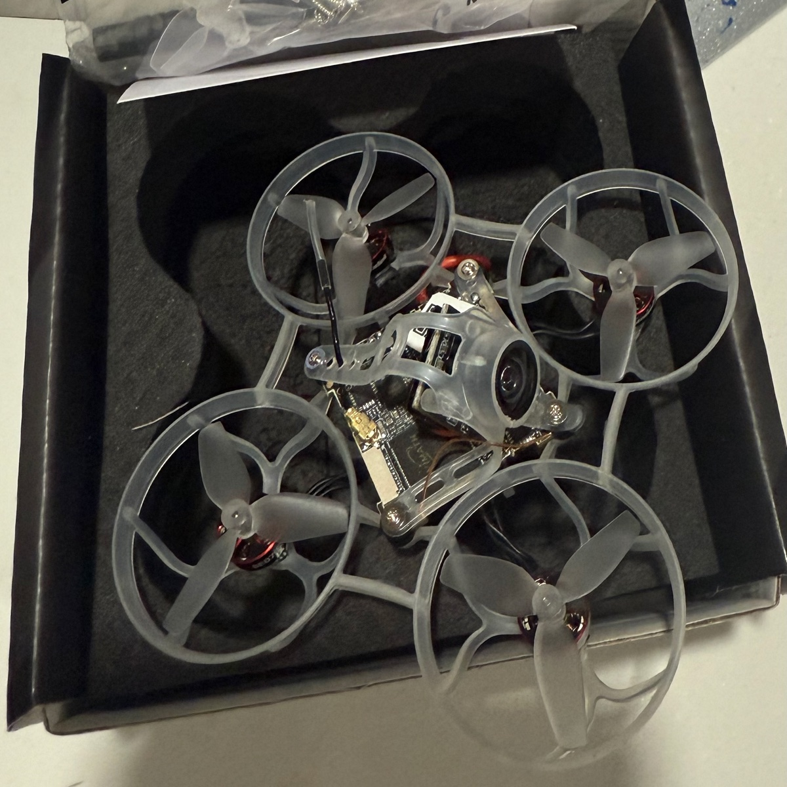
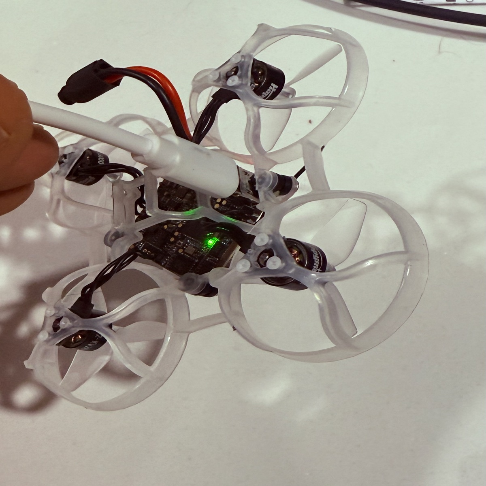
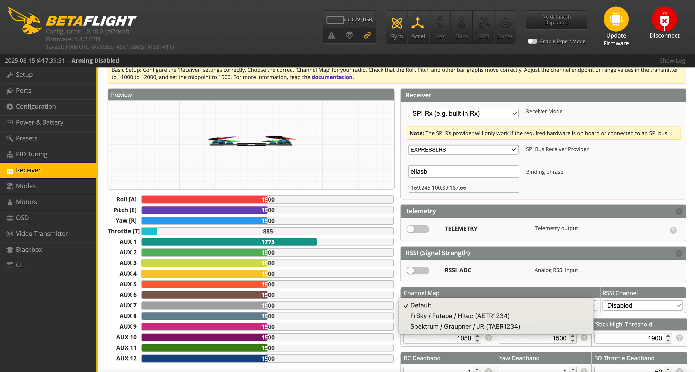
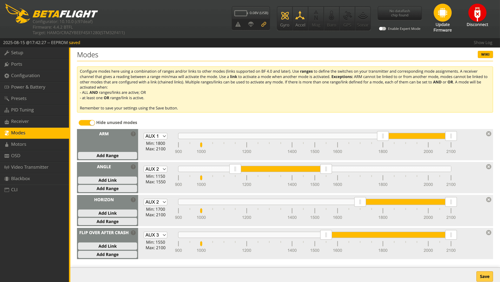
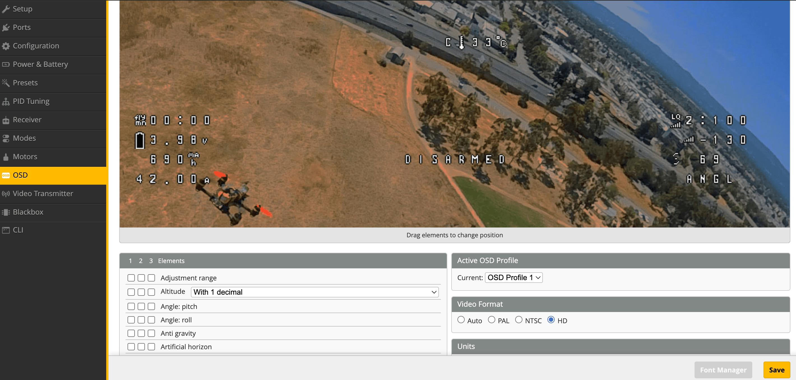
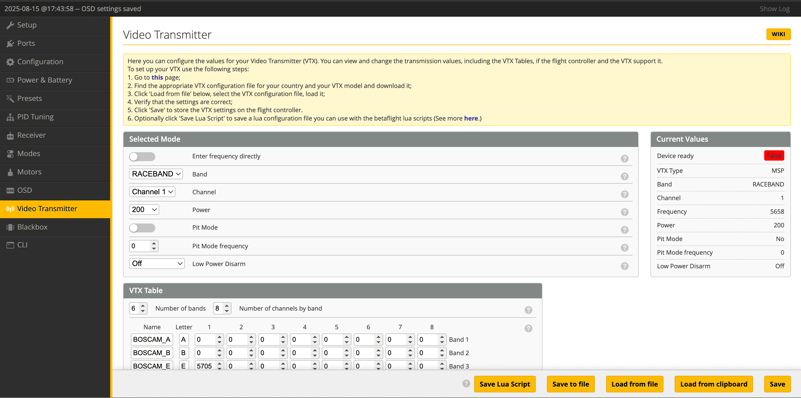

# HappyModel Mobula6 HD Race (HDZero Edition) Setup Guide

This comprehensive guide walks you through setting up your HappyModel Mobula6 HD Race (HDZero edition) tinywhoop drone using Betaflight Configurator. From initial connection to pre-flight checks, this guide ensures your drone is properly configured and ready for safe indoor and outdoor flying.

## Table of Contents

- [Overview](#overview)
- [Requirements](#requirements)
- [Setup Instructions](#setup-instructions)
  - [1. Initial Connection and Safety](#1-initial-connection-and-safety)
  - [2. Receiver Configuration](#2-receiver-configuration)
  - [3. Configure Flight Modes](#3-configure-flight-modes)
  - [4. Configure OSD Elements](#4-configure-osd-elements)
  - [5. Configure Video Transmitter](#5-configure-video-transmitter)
  - [6. Pre-flight Checklist](#6-pre-flight-checklist)

## Overview

The HappyModel Mobula6 HD Race (HDZero edition) is a popular 65mm tinywhoop drone that offers excellent performance for both indoor and outdoor flying. As a BNF (Bind and Fly) drone, it comes pre-assembled with the props already installed correctly, making it easier to configure and get flying quickly. This guide covers the essential Betaflight configuration steps to get your drone flight-ready.

Please check the supporting video here: [https://www.youtube.com/watch?v=pySlHBlj5Zg](https://www.youtube.com/watch?v=pySlHBlj5Zg).

### Key Features

- 65mm frame size perfect for indoor flying
- Built-in HD recording capability
- ELRS receiver for long-range control
- Powerful motors for acrobatic flight
- Lightweight design for extended flight times

## Requirements

Before starting the setup process, ensure you have:

- **HappyModel Mobula6 HD Race (HDZero edition) drone**
- **Micro USB cable** for connecting to your computer
- **[Betaflight Configurator](https://github.com/betaflight/betaflight-configurator/releases)** installed (version 10.10.0 or later)
- **Cooling fan** (CRITICAL - drone will overheat when connected via USB without airflow)
- **Radio transmitter** (e.g., Radiomaster Boxer) already configured with binding phrase `eliasb` (for example)
- **1S batteries** charged and ready for testing (needed at the end)

## Setup Instructions

### 1. Initial Connection and Safety

**CRITICAL SAFETY WARNING**: The Mobula6 HD Race will overheat when connected to USB without proper cooling. Always use a fan to cool the drone during USB connection.

1. **Set up cooling**
   - Position a small fan to blow directly on the drone
   - Ensure the fan is running before connecting USB

2. **Connect to Betaflight Configurator**
   - Connect the drone to your computer using a micro USB cable
   - The drone should be positioned with the fan blowing on it continuously
   
   

3. **Open Betaflight Configurator**
   - Launch [Betaflight Configurator](https://github.com/betaflight/betaflight-configurator/releases)
   - Select the correct COM port (usually shows as "USB Serial Device")
   - Click "Connect" in the top-right corner
   - You should see the drone model animate as you move the physical drone

### 2. Receiver Configuration

Navigate to the **Receiver** tab in Betaflight Configurator.

**Configuration steps:**

1. **Verify receiver protocol**
   - Receiver Mode should be set to `SPI Rx (e.g. built-in Rx)`
   - SPI Bus Receiver Provider should be set to `EXPRESSLRS`

2. **Confirm binding**
   - Your transmitter (e.g., Radiomaster Boxer) should already be configured with binding phrase: `eliasb`
   - This binding phrase should match what's shown in the Binding phrase field
   - The receiver bars should move when you move your transmitter sticks
   - Click "Save" button in the bottom-right corner

3. **Channel mapping**
   - Ensure Channel Map is set appropriately ('TAER1234' in our case)
   - Verify stick movements correspond correctly in the preview window

### 3. Configure Flight Modes

Navigate to the **Modes** tab to set up your auxiliary switches for arming and flight modes.

**Recommended mode setup:**

The following AUX assignments are my personal preference, but you can adjust them to suit your needs.

1. **ARM mode (AUX 1)**
   - Add "ARM" mode
   - Assign to AUX 1
   - Set range: 1800-2100
   - This allows you to arm/disarm the drone with a switch

2. **ANGLE mode (AUX 2)**
   - Add "ANGLE" mode
   - Assign to AUX 2
   - Set range: 1150-1550
   - Provides self-leveling for beginners

3. **HORIZON mode (AUX 2)**
   - Add "HORIZON" mode  
   - Assign to AUX 2
   - Set range: 1700-2100
   - Allows flips while maintaining some self-leveling

4. **FLIP OVER AFTER CRASH (AUX 3)**
   - Add "FLIP OVER AFTER CRASH" mode
   - Assign to AUX 3
   - Set range: 1550-2100
   - Helps recover from crashes by reversing motors

**Flight mode explanation:**
- **No mode active (AUX 2 low)**: ACRO mode - full manual control
- **AUX 2 middle**: ANGLE mode - self-leveling, good for beginners
- **AUX 2 high**: HORIZON mode - self-leveling with ability to do flips

5. **Save configuration**
   - Click "Save" button to apply changes

### 4. Configure OSD Elements

Navigate to the **OSD** tab to customize your on-screen display elements.

**Essential OSD elements for tinywhoop flying:**

1. **Battery monitoring**
   - Battery voltage
   - Battery percentage (if available)
   - Flight timer

2. **Flight information**
   - Armed/Disarmed status
   - Flight mode indicator
   - Throttle position

3. **Technical data**
   - RSSI (signal strength)
   - VTX channel/frequency
   - Warnings (low battery, etc.)

I also recommend enabling the crosshair element for improved orientation during flight.

**Configuration steps:**
1. Enable desired OSD elements using checkboxes
2. Drag elements to preferred positions on the preview screen
3. Test visibility - ensure critical info isn't obscured
4. Click "Save" to apply changes

### 5. Configure Video Transmitter

Navigate to the **Video Transmitter** tab to configure your VTX settings.

**Configuration steps:**

1. **Select appropriate settings for your region**
   - Band: Choose based on local regulations and other pilots
   - Channel: Select an unused channel
   - Power: Start with 25mW for indoor flying
   - For outdoor/racing: May increase to 200mW or higher (check local laws)

2. **Common band/channel combinations**
   - Raceband (R): Popular for racing
   - Fatshark (F): Good compatibility
   - Choose channels with good separation when flying with others

3. **VTX table**
   - Ensure VTX table is loaded
   - This defines available frequencies and power levels

4. **Save settings**
   - Click "Save" to apply VTX configuration

### 6. Pre-flight Checklist

**IMPORTANT**: New drones often ship with loose screws. This is the most common cause of issues with new builds.

1. **Check props and tighten all screws**
   - Props are already installed correctly from the factory (BNF advantage)
   - Give props a gentle tug to ensure they are fitted correctly
   - Check and tighten all frame screws
   - Verify motor screws are secure
   - Ensure camera mount is tight
   - Check canopy/top plate screws

