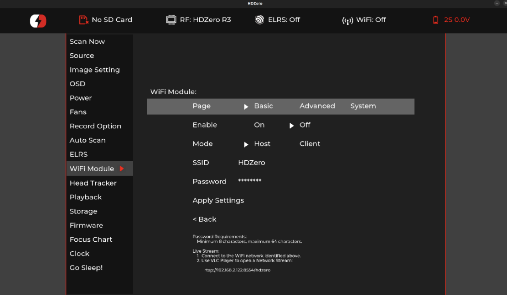

# HDZero RTSP Streaming Setup Guide

This comprehensive guide shows you how to stream HDZero RTSP video to both local networks and the internet using dual WiFi adapters on Windows. With this setup, you can stream footage directly from your HDZero goggle (v1 + WiFi modules or v2) to any device and share live streams with friends around the world using [VLC](https://www.videolan.org) and Cloudflare tunnels.

## Table of Contents

- [Overview](#overview)
- [Requirements](#requirements)
- [Setup Instructions](#setup-instructions)
  - [1. Connect to HDZero Network](#1-connect-to-hdzero-network)
  - [2. Start VLC HTTP Relay Server](#2-start-vlc-http-relay-server)
  - [3. Test Local HTTP Stream](#3-test-local-http-stream)
  - [4. Create Internet Tunnel](#4-create-internet-tunnel)
  - [5. Share Stream Access](#5-share-stream-access)
- [Appendices](#appendices)
  - [Appendix A: Command Line WiFi Setup](#appendix-a-command-line-wifi-setup)
  - [Appendix B: Network Topology](#appendix-b-network-topology)
  - [Appendix C: Troubleshooting](#appendix-c-troubleshooting)

## Overview

This setup creates a robust streaming solution that enables you to stream HDZero RTSP video both locally and over the internet using a Windows PC with dual WiFi capability to bridge the HDZero network and the internet.

### How It Works

1. **Dual WiFi Connectivity**: Your Windows PC connects simultaneously to:
   - The HDZero network via USB WiFi adapter (receives RTSP stream from goggle)
   - Your home internet via built-in WiFi adapter (provides internet access)

2. **VLC HTTP Relay**: VLC Media Player acts as a relay server that:
   - Receives the RTSP stream from the HDZero device (`rtsp://192.168.2.122:8554/hdzero`)
   - Converts it to HTTP transport stream accessible on all network interfaces
   - Serves the stream on port 8554 for both local and tunnel access

3. **Dual Access Methods**:
   - **Local Streaming**: Direct access via `http://[PC-IP]:8554/` for devices on your local network (lower latency, no bandwidth usage)
   - **Internet Streaming**: Cloudflare tunnel provides secure worldwide access via `https://random-words.trycloudflare.com/`

### Required Processes

To maintain the stream, you'll need to keep these running:
- VLC HTTP relay terminal window (converts RTSP to HTTP)
- Cloudflare tunnel terminal window (provides internet access)
- Both WiFi connections active (HDZero and internet)

## Requirements

- Windows PC with dual WiFi capability (built-in + USB WiFi adapter)
- VLC Media Player installed
- cloudflared (Cloudflare Tunnel client) installed
- HDZero goggle (v1 + WiFi modules or v2) with WiFi enabled

## Setup Instructions

### 1. Connect to HDZero Network

#### Using Windows GUI

1. **Prepare Your HDZero Device**
   - Turn on your HDZero goggle and ensure WiFi is enabled

   - The device will broadcast a network named "HDZero" with password "divimath"

2. **Connect Your USB WiFi Adapter**
   - Plug in your USB WiFi adapter (this will be dedicated to the HDZero network)

3. **Connect to HDZero Network**
   - Click the WiFi icon in your system tray (bottom-right corner)
   - Look for the "HDZero" network in the available networks list
   - Click on "HDZero" network
   - Click "Connect"
   - When prompted for the password, enter: `divimath`
   - Click "Next" to connect

4. **Verify Dual WiFi Connection**
   - Your built-in WiFi adapter should remain connected to your internet WiFi
   - Your USB WiFi adapter should now be connected to the HDZero network
   - You can verify this by checking both adapters show "Connected" status


**Important**: Ensure you have two active WiFi connections:
- **Built-in adapter**: Connected to your home/internet WiFi
- **USB adapter**: Connected to HDZero network

*Note: For command line setup method, see [Appendix A: Command Line WiFi Setup](#appendix-a-command-line-wifi-setup)*

### 2. Start VLC HTTP Relay Server

Run this command to create an HTTP server that serves the RTSP stream to all network interfaces:

```cmd
vlc rtsp://192.168.2.122:8554/hdzero --intf dummy --sout "#http{mux=ts,dst=:8554/}"
```

**Command breakdown**:
- `rtsp://192.168.2.122:8554/hdzero` - Source HDZero RTSP stream
- `--intf dummy` - Run VLC headless (no GUI)
- `--sout "#http{mux=ts,dst=:8554/}"` - Stream via HTTP on port 8554
- `dst=:8554/` - Bind to all interfaces, serve at root path (crucial for compatibility)

**Important Notes**:
- Do NOT include `/hdzero` in the destination path - use root path `/` only
- Leave this VLC instance running - it's your relay server
- Use Task Manager to kill the "vlc.exe" process when done
- You should see streaming output in the console

### 3. Test Local HTTP Stream

Before setting up the internet tunnel, verify the HTTP relay works locally:

**Test from Windows PC (same machine):**
```cmd
vlc http://127.0.0.1:8554/
```

**Test from other local devices (MacBook, phones, etc.):**
```
http://192.168.155:8554/
```
*(Replace `192.168.155` with your actual Windows PC IP)*

**Expected result**: VLC should open and display the HDZero video feed. If this doesn't work, the Cloudflare tunnel won't work either.

### 4. Create Internet Tunnel

#### Install cloudflared (one-time setup)
```cmd
winget install --id Cloudflare.cloudflared
```

If prompted, you can manually log in by running:
```cmd
cloudflared login
```
 
#### Start the tunnel
Once local testing works, create the internet tunnel:

```cmd
cloudflared tunnel --url http://localhost:8554
```

This will output something like: `https://random-words.trycloudflare.com`

**Keep this terminal window open** - closing it will stop the tunnel.

### 5. Share Stream Access

#### For Remote Friends (Internet Access)
Share the Cloudflare tunnel URL:
```
https://random-words.trycloudflare.com/
```

**Instructions for friends**:
1. Open VLC Media Player
2. Go to Media → Open Network Stream
3. Enter the Cloudflare URL: `https://random-words.trycloudflare.com/`
4. Click Play

#### For Local Devices (MacBook, phones, etc.)
Use your Windows PC's local IP:
```
http://192.168.155:8554/
```

**Advantages of local access**:
- No internet bandwidth usage
- Lower latency
- More reliable connection

To find your Windows PC IP:
```cmd
ipconfig | findstr "IPv4"
```

## Appendices

### Appendix A: Command Line WiFi Setup

For advanced users who prefer command line methods:

#### Create an HDZero WiFi Profile

Create a file called `HDZero.xml` with this content:

```xml
<?xml version="1.0"?>
<WLANProfile xmlns="http://www.microsoft.com/networking/WLAN/profile/v1">
    <name>HDZero</name>
    <SSIDConfig>
        <SSID>
            <name>HDZero</name>
        </SSID>
    </SSIDConfig>
    <connectionType>ESS</connectionType>
    <connectionMode>auto</connectionMode>
    <MSM>
        <security>
            <authEncryption>
                <authentication>WPA2PSK</authentication>
                <encryption>AES</encryption>
                <useOneX>false</useOneX>
            </authEncryption>
            <sharedKey>
                <keyType>passPhrase</keyType>
                <protected>false</protected>
                <keyMaterial>divimath</keyMaterial>
            </sharedKey>
        </security>
    </MSM>
</WLANProfile>
```

#### Connect Using Command Line

```cmd
rem Add the WiFi profile
netsh wlan add profile filename="HDZero.xml"

rem Connect USB adapter to HDZero network
netsh wlan connect name="HDZero" interface="Wi-Fi"

rem Verify both connections
netsh wlan show interfaces
```

You should see:
- Built-in adapter: Connected to internet WiFi
- USB adapter: Connected to HDZero network

### Appendix B: Network Topology

```
HDZero Device (192.168.2.122:8554)
    ↓ (USB WiFi Adapter)
Windows PC VLC HTTP Relay (:8554/)
    ↓ ↓
    ↓ Local Network (MacBook via LAN)
    ↓
Cloudflare Tunnel → Internet (Remote friends)
```

### Appendix C: Troubleshooting

#### Verify HDZero Connection
```cmd
ping 192.168.2.122
```

#### Check if VLC relay is working locally
Test with: `http://127.0.0.1:8554/` or `http://192.168.155:8554/`

#### Verify port is listening
```cmd
netstat -an | findstr :8554
```
Should show: `TCP 0.0.0.0:8554 0.0.0.0:0 LISTENING`

#### Check Cloudflare tunnel status
Check the terminal window running cloudflared for connection status and the assigned URL

#### Common Issues and Solutions

**VLC relay not working**:
- Ensure HDZero device is reachable: `ping 192.168.2.122`
- Check Windows Firewall isn't blocking port 8554
- Verify both WiFi connections are active: `netsh wlan show interfaces`

**Cloudflare tunnel not accessible**:
- Test local HTTP stream first - if it doesn't work locally, Cloudflare tunnel won't work
- Ensure cloudflared is installed correctly: `cloudflared --version`
- Try restarting the tunnel - you'll get a new random URL

**Stream quality issues**:
- Check HDZero signal strength
- Ensure stable WiFi connections on both networks
- Consider lowering video quality if bandwidth is limited